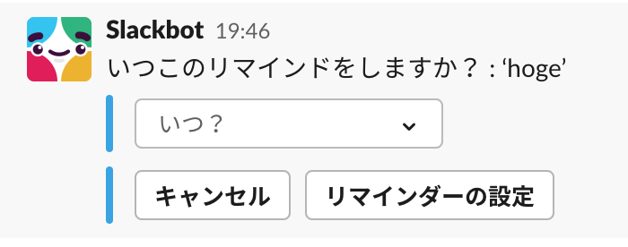
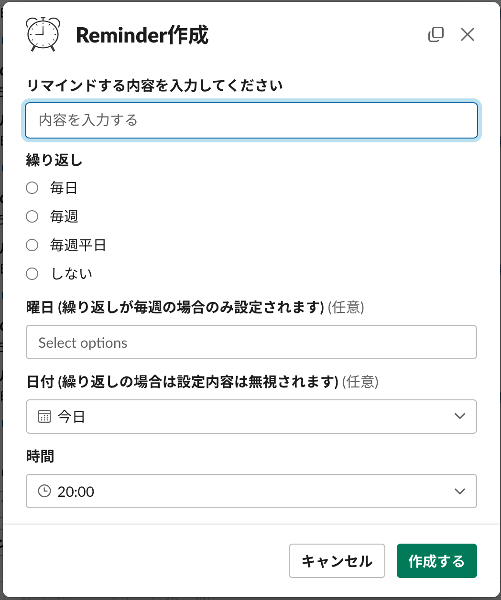

# (ボツ) slack-reminder-modal

Slack の `/remind` コマンドで `/remind 'hoge' at 19:00 every Monday` みたいに入力するのが面倒なのと、覚えられないので、GUI で設定できるようにモーダルを作成した。

だが、実装しているなかで、既に GUI 的なのが存在することを知ってしまったので断念。

(途中まで作ったのはもったいないのでここで供養する)

そもそもの Slack の機能では `/remind 'hoge'` だけ打つと、あとはインタラクティブに設定できる。

## ちなみに

- こんな感じで途中まで作ってみた。(`/create_reminder` で起動するような感じ)

   

- 一応リマインダーも作成できるところまで対応したが、いろいろ問題があるのであまり使い物にはならない。

- コードもあまり見直したりしていないので汚い。

## 参考

- https://api.slack.com/methods/reminders.add#examples

- https://api.slack.com/methods/views.open
